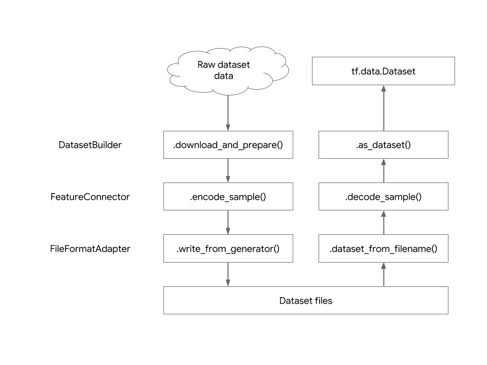

# Adding a dataset

Follow this guide to add a dataset to TFDS.

See our [list of datasets](catalog/overview.md) to see if the dataset you want
isn't already added.

*   [Overview](#overview)
*   [Writing `my_dataset.py`](#writing-my_datasetpy)
    *   [Use the default template](#use-the-default-template)
    *   [DatasetBuilder](#datasetbuilder)
    *   [my_dataset.py](#my_datasetpy)
*   [Specifying `DatasetInfo`](#specifying-datasetinfo)
    *   [`FeatureConnector`s](#featureconnectors)
*   [Downloading and extracting source data](#downloading-and-extracting-source-data)
    *   [Manual download and extraction](#manual-download-and-extraction)
*   [Specifying dataset splits](#specifying-dataset-splits)
*   [Writing an example generator](#writing-an-example-generator)
    *   [File access and `tf.io.gfile`](#file-access-and-tfiogfile)
    *   [Extra dependencies](#extra-dependencies)
    *   [Corrupted data](#corrupted-data)
    *   [Inconsistent data](#inconsistent-data)
*   [Dataset configuration](#dataset-configuration)
    *   [Heavy configuration with BuilderConfig](#heavy-configuration-with-builderconfig)
    *   [Light configuration with constructor args](#light-configuration-with-constructor-args)
*   [Create your own `FeatureConnector`](#create-your-own-featureconnector)
*   [Adding the dataset to `tensorflow/datasets`](#adding-the-dataset-to-tensorflowdatasets)
    *   [1. Add an import for registration](#1-add-an-import-for-registration)
    *   [2. Run download_and_prepare locally](#2-run-download_and_prepare-locally)
    *   [3. Double-check the citation](#3-double-check-the-citation)
    *   [4. Add a test](#4-add-a-test)
    *   [5. Check your code style](#5-check-your-code-style)
    *   [6. Send for review!](#6-send-for-review)
*   [Define the dataset outside TFDS](#define-the-dataset-outside-tfds)
*   [Large datasets and distributed generation](#large-datasets-and-distributed-generation)
*   [Testing `MyDataset`](#testing-mydataset)

## Overview

Datasets are distributed in all kinds of formats and in all kinds of places,
and they're not always stored in a format that's ready to feed into a machine
learning pipeline. Enter TFDS.

TFDS provides a way to transform all those datasets into a standard format,
do the preprocessing necessary to make them ready for a machine learning
pipeline, and provides a standard input pipeline using `tf.data`.

To enable this, each dataset implements a subclass of `DatasetBuilder`, which
specifies:

* Where the data is coming from (i.e. its URL);
* What the dataset looks like (i.e. its features);
* How the data should be split (e.g. `TRAIN` and `TEST`);
* and the individual records in the dataset.

The first time a dataset is used, the dataset is downloaded, prepared, and
written to disk in a standard format. Subsequent access will read from those
pre-processed files directly.

**Note**: Currently we do not support datasets that take longer than 1 day to
generate on a single machine. See the
[section below on large datasets](#large-datasets-and-distributed-generation).

## Writing `my_dataset.py`

### Use the default template

If you want to
[contribute to our repo](https://github.com/tensorflow/datasets/blob/master/CONTRIBUTING.md)
and add a new dataset, the following script will help you get started by
generating the required python files,...
To use it, clone the `tfds` repository and run the following command:

```
python tensorflow_datasets/scripts/create_new_dataset.py \
  --dataset my_dataset \
  --type image  # text, audio, translation,...
```


Then search for `TODO(my_dataset)` in the generated files to do the
modifications.

### `DatasetBuilder`

Each dataset is defined as a subclass of `tfds.core.DatasetBuilder` implementing
the following methods:

*   `_info`: builds the `tfds.core.DatasetInfo` object describing the dataset
*   `_download_and_prepare`: to download and serialize the source data to disk
*   `_as_dataset`: to produce a `tf.data.Dataset` from the serialized data

Most datasets subclass `tfds.core.GeneratorBasedBuilder`, which is a subclass of
`tfds.core.DatasetBuilder` that simplifies defining a dataset. It works well for
datasets that can be generated on a single machine. Its subclasses implement:

*   `_info`: builds the `tfds.core.DatasetInfo` object describing the dataset
*   `_split_generators`: downloads the source data and defines the dataset
    splits
*   `_generate_examples`: yields `(key, example)` tuples in the dataset from the
    source data

This guide will use `GeneratorBasedBuilder`.

### `my_dataset.py`

`my_dataset.py` first looks like this:

```python
import tensorflow_datasets.public_api as tfds

class MyDataset(tfds.core.GeneratorBasedBuilder):
  """Short description of my dataset."""

  VERSION = tfds.core.Version('0.1.0')

  def _info(self):
    # Specifies the tfds.core.DatasetInfo object
    pass # TODO

  def _split_generators(self, dl_manager):
    # Downloads the data and defines the splits
    # dl_manager is a tfds.download.DownloadManager that can be used to
    # download and extract URLs
    pass  # TODO

  def _generate_examples(self):
    # Yields examples from the dataset
    yield 'key', {}
```

If you'd like to follow a test-driven development workflow, which can help you
iterate faster, jump to the [testing instructions](#testing-mydataset) below,
add the test, and then return here.

For an explanation of what the version is, please read
[datasets versioning](datasets_versioning.md).

## Specifying `DatasetInfo`

`tfds.core.DatasetInfo` describes the dataset.

```python
class MyDataset(tfds.core.GeneratorBasedBuilder):

  def _info(self):
    return tfds.core.DatasetInfo(
        builder=self,
        # This is the description that will appear on the datasets page.
        description=("This is the dataset for xxx. It contains yyy. The "
                     "images are kept at their original dimensions."),
        # tfds.features.FeatureConnectors
        features=tfds.features.FeaturesDict({
            "image_description": tfds.features.Text(),
            "image": tfds.features.Image(),
            # Here, labels can be of 5 distinct values.
            "label": tfds.features.ClassLabel(num_classes=5),
        }),
        # If there's a common (input, target) tuple from the features,
        # specify them here. They'll be used if as_supervised=True in
        # builder.as_dataset.
        supervised_keys=("image", "label"),
        # Homepage of the dataset for documentation
        homepage="https://dataset-homepage.org",
        # Bibtex citation for the dataset
        citation=r"""@article{my-awesome-dataset-2020,
                              author = {Smith, John},"}""",
    )
```

### `FeatureConnector`s

Each feature is specified in `DatasetInfo` as a
`tfds.features.FeatureConnector`. `FeatureConnector`s document each feature,
provide shape and type checks, and abstract away serialization to and from disk.
There are many feature types already defined and you can also
[add a new one](#create-your-own-featureconnector).

If you've implemented the test harness, `test_info` should now pass.

## Downloading and extracting source data

Most datasets need to download data from the web. All downloads and extractions
must go through the `tfds.download.DownloadManager`. `DownloadManager` currently
supports extracting `.zip`, `.gz`, and `.tar` files.

For example, one can both download and extract URLs with `download_and_extract`:

```python
def _split_generators(self, dl_manager):
  # Equivalent to dl_manager.extract(dl_manager.download(urls))
  dl_paths = dl_manager.download_and_extract({
      'foo': 'https://example.com/foo.zip',
      'bar': 'https://example.com/bar.zip',
  })
  dl_paths['foo'], dl_paths['bar']
```

### Manual download and extraction

For source data that cannot be automatically downloaded (for
example, it may require a login), the user will manually download the source
data and place it in `manual_dir`, which you can access with
`dl_manager.manual_dir` (defaults to `~/tensorflow_datasets/manual/my_dataset`).

## Specifying dataset splits

If the dataset comes with pre-defined splits (for example, MNIST has train and
test splits), keep those splits in the `DatasetBuilder`. If the dataset does not
have predefined splits, `DatasetBuilder` should only specify a single
`tfds.Split.TRAIN` split. Users can dynamically create their own subsplits
with the
[subsplit API](https://github.com/tensorflow/datasets/tree/master/docs/splits.md)
(e.g. `split='train[80%:]'`).

```python
  def _split_generators(self, dl_manager):
    # Download source data
    extracted_path = dl_manager.download_and_extract(...)

    # Specify the splits
    return [
        tfds.core.SplitGenerator(
            name=tfds.Split.TRAIN,
            gen_kwargs={
                "images_dir_path": os.path.join(extracted_path, "train"),
                "labels": os.path.join(extracted_path, "train_labels.csv"),
            },
        ),
        tfds.core.SplitGenerator(
            name=tfds.Split.TEST,
            gen_kwargs={
                "images_dir_path": os.path.join(extracted_path, "test"),
                "labels": os.path.join(extracted_path, "test_labels.csv"),
            },
        ),
    ]
```

`SplitGenerator` describes how a split should be generated. `gen_kwargs`
will be passed as keyword arguments to `_generate_examples`, which we'll define
next.

## Writing an example generator

`_generate_examples` generates the examples for each split from the
source data. For the `TRAIN` split with the `gen_kwargs` defined above,
`_generate_examples` will be called as:

```python
builder._generate_examples(
    images_dir_path="{extracted_path}/train",
    labels="{extracted_path}/train_labels.csv",
)
```

This method will typically read source dataset artifacts (e.g. a CSV file) and
yield (key, feature dictionary) tuples that correspond to the features specified
in `DatasetInfo`.

```python
def _generate_examples(self, images_dir_path, labels):
  # Read the input data out of the source files
  for image_file in tf.io.gfile.listdir(images_dir_path):
    ...
  with tf.io.gfile.GFile(labels) as f:
    ...

  # And yield examples as feature dictionaries
  for image_id, description, label in data:
    yield image_id, {
        "image_description": description,
        "image": "%s/%s.jpeg" % (images_dir_path, image_id),
        "label": label,
    }
```

`DatasetInfo.features.encode_example` will encode these dictionaries into a
format suitable for writing to disk (currently we use `tf.train.Example`
protocol buffers). For example, `tfds.features.Image` will copy out the
JPEG content of the passed image files automatically.

The key (here: `image_id`) should uniquely identify the record. It is used to
shuffle the dataset globally. If two records are yielded using the same key,
an exception will be raised during preparation of the dataset.

If you've implemented the test harness, your builder test should now pass.

### File access and `tf.io.gfile`

In order to support Cloud storage systems, use
`tf.io.gfile` or other TensorFlow file APIs (for example, `tf.python_io`)
for all filesystem access. Avoid using Python built-ins for file operations
(e.g. `open`, `os.rename`, `gzip`, etc.).

### Extra dependencies

Some datasets require additional Python dependencies during data generation.
For example, the SVHN dataset uses `scipy` to load some data. In order to
keep the `tensorflow-datasets` package small and allow users to install
additional dependencies only as needed, use `tfds.core.lazy_imports`.

To use `lazy_imports`:

*   Add an entry for your dataset into `DATASET_EXTRAS` in
    [`setup.py`](https://github.com/tensorflow/datasets/tree/master/setup.py).
    This makes it so that users can do, for example, `pip install
    'tensorflow-datasets[svhn]'` to install the extra dependencies.
*   Add an entry for your import to
    [`LazyImporter`](https://github.com/tensorflow/datasets/tree/master/tensorflow_datasets/core/lazy_imports_lib.py)
    and to the
    [`LazyImportsTest`](https://github.com/tensorflow/datasets/tree/master/tensorflow_datasets/core/lazy_imports_lib_test.py).
*   Use `tfds.core.lazy_imports` to access the dependency (for example,
    `tfds.core.lazy_imports.scipy`) in your `DatasetBuilder`.


### Corrupted data

Some datasets are not perfectly clean and contain some corrupt data
(for example, the images are in JPEG files but some are invalid JPEG). These
examples should be skipped, but leave a note in the dataset description how
many examples were dropped and why.

### Inconsistent data

Some datasets provide a set of URLs for individual records or features
(for example, URLs to various images around the web) that may or may not
exist anymore. These datasets are difficult to version properly because the
source data is unstable (URLs come and go).

If the dataset is inherently unstable (that is, if multiple runs over time
may not yield the same data), mark the dataset as unstable by adding a
class constant to the `DatasetBuilder`:
`UNSTABLE = "<why this dataset is unstable">`. For example,
`UNSTABLE = "Downloads URLs from the web."`

## Dataset configuration

Some datasets may have variants that should be exposed, or options for how the
data is preprocessed. These configurations can be separated into 2 categories:

1. "Heavy": Configuration that affects how the data is written to disk. We'll
   call this "heavy" configuration.
2. "Light": Configuration that affects runtime preprocessing (i.e.
   configuration that can be done in a `tf.data` input pipeline). We'll call
   this "light" configuration.

### Heavy configuration with `BuilderConfig`

Heavy configuration affects how the data is written to disk. For example, for
text datasets, different `TextEncoder`s and vocabularies affect the token ids
that are written to disk.

Heavy configuration is done through `tfds.core.BuilderConfig`s:

1. Define your own configuration object as a subclass of
   `tfds.core.BuilderConfig`. For example, `MyDatasetConfig`.
2. Define the `BUILDER_CONFIGS` class member in `MyDataset` that lists
   `MyDatasetConfig`s that the dataset exposes.
3. Use `self.builder_config` in `MyDataset` to configure data generation. This
   may include setting different values in `_info()` or changing download data
   access.

Datasets with `BuilderConfig`s have a name and version per config,
so the fully qualified name of a particular variant would be
`dataset_name/config_name` (for example, `"lm1b/bytes"`). The config defaults
to the first one in `BUILDER_CONFIGS` (for example "`lm1b`" defaults to
`"lm1b/plain_text"`).

See [`Lm1b`](https://github.com/tensorflow/datasets/tree/master/tensorflow_datasets/text/lm1b.py)
for an example of a dataset that uses `BuilderConfig`s.

### Light configuration with constructor args

For situations where alterations could be made
on-the-fly in the `tf.data` input pipeline, add keyword arguments to the
`MyDataset` constructor, store the values in member variables,
and then use them later. For example, override `_as_dataset()`, call `super()`
to get the base `tf.data.Dataset`, and then do additional transformations
based on the member variables.

## Create your own `FeatureConnector`

Note that most datasets will find the current set of
`tfds.features.FeatureConnector`s sufficient, but sometimes a new one may need
to be defined.

Note: If you need a new `FeatureConnector` not present in the default set and
are planning to submit it to `tensorflow/datasets`, please open a
[new issue](https://github.com/tensorflow/datasets/issues/new?assignees=&labels=enhancement&template=feature_request.md&title=)
on GitHub with your proposal.

`tfds.features.FeatureConnector`s in `DatasetInfo` correspond to the elements
returned in the `tf.data.Dataset` object. For instance, with:

```
tfds.DatasetInfo(features=tfds.features.FeatureDict({
    'input': tfds.features.Image(),
    'output': tfds.features.Text(encoder=tfds.text.ByteEncoder()),
    'metadata': {
        'description': tfds.features.Text(),
        'img_id': tf.int32,
    },
}))
```

The items in `tf.data.Dataset` object would look like:

```
{
    'input': tf.Tensor(shape=(None, None, 3), dtype=tf.uint8),
    'output': tf.Tensor(shape=(None,), dtype=tf.int32),  # Sequence of token ids
    'metadata': {
        'description': tf.Tensor(shape=(), dtype=tf.string),
        'img_id': tf.Tensor(shape=(), dtype=tf.int32),
    },
}
```

The `tfds.features.FeatureConnector` object abstracts away how the feature is
encoded on disk from how it is presented to the user. Below is a
diagram showing the abstraction layers of the dataset and the transformation
from the raw dataset files to the `tf.data.Dataset` object.

<p align="center">
  
</p>

To create your own feature connector, subclass `tfds.features.FeatureConnector`
and implement the abstract methods:

*   `get_tensor_info()`: Indicates the shape/dtype of the tensor(s) returned by
    `tf.data.Dataset`
*   `encode_example(input_data)`: Defines how to encode the data given in the
    generator `_generate_examples()` into a `tf.train.Example` compatible data
*   `decode_example`: Defines how to decode the data from the tensor read from
    `tf.train.Example` into user tensor returned by `tf.data.Dataset`.
*   (optionally) `get_serialized_info()`: If the info returned by
    `get_tensor_info()` is different from how the data are actually written on
    disk, then you need to overwrite `get_serialized_info()` to match the specs
    of the `tf.train.Example`

1.  If your connector only contains one value, then the `get_tensor_info`,
    `encode_example`, and `decode_example` methods can directly return single
    value (without wrapping it in a dict).

2.  If your connector is a container of multiple sub-features, the easiest way
    is to inherit from `tfds.features.FeaturesDict` and use the `super()`
    methods to automatically encode/decode the sub-connectors.

Have a look at `tfds.features.FeatureConnector` for more details and the
`tfds.features` package for more examples.

## Adding the dataset to `tensorflow/datasets`

If you'd like to share your work with the community, you can check in your
dataset implementation to `tensorflow/datasets`. Thanks for thinking of
contributing!

Before you send your pull request, follow these last few steps:

### 1. Add an import for registration

All subclasses of `tfds.core.DatasetBuilder` are automatically registered
when their module is imported such that they can be accessed through
`tfds.builder` and `tfds.load`.

If you're contributing the dataset to `tensorflow/datasets`, add the module
import to its subdirectory's `__init__.py`
(e.g. [`image/__init__.py`](https://github.com/tensorflow/datasets/tree/master/tensorflow_datasets/image/__init__.py).

### 2. Run `download_and_prepare` locally.

If you're contributing the dataset to `tensorflow/datasets`, add a checksums
file for the dataset. On first download, the `DownloadManager` will
automatically add the sizes and checksums for all downloaded URLs to that file.
This ensures that on subsequent data generation, the downloaded files are
as expected.

```sh
touch tensorflow_datasets/url_checksums/my_new_dataset.txt
```

Run `download_and_prepare` locally to ensure that data generation works:

```
# default data_dir is ~/tensorflow_datasets
python -m tensorflow_datasets.scripts.download_and_prepare \
  --register_checksums \
  --datasets=my_new_dataset
```

Note that the `--register_checksums` flag must only be used while in development.

Copy in the contents of the `dataset_info.json` file(s) to a [GitHub gist](https://gist.github.com/) and link to it in your pull request.


### 3. Double-check the citation

It's important that `DatasetInfo.citation` includes a good citation for the
dataset. It's hard and important work contributing a dataset to the community
and we want to make it easy for dataset users to cite the work.

If the dataset's website has a specifically requested citation, use that
(in BibTex format).

If the paper is on [arXiv](https://arxiv.org/), find it there and click the
`bibtex` link on the right-hand side.

If the paper is not on arXiv, find the paper on
[Google Scholar](https://scholar.google.com) and click the double-quotation mark
underneath the title and on the popup, click `BibTeX`.

If there is no associated paper (for example, there's just a website), you can
use the
[BibTeX Online Editor](https://truben.no/latex/bibtex/) to create a custom
BibTeX entry (the drop-down menu has an `Online` entry type).

### 4. Add a test

Most datasets in TFDS should have a unit test and your reviewer may ask you
to add one if you haven't already. See the
[testing section](#testing-mydataset) below.

### 5. Check your code style

Follow the [PEP 8 Python style guide](https://www.python.org/dev/peps/pep-0008),
except TensorFlow uses 2 spaces instead of 4. Please conform to the
[Google Python Style Guide](https://github.com/google/styleguide/blob/gh-pages/pyguide.md),

Most importantly, use
[`./oss_scripts/lint.sh`](https://github.com/tensorflow/datasets/tree/master/oss_scripts/lint.sh)
to ensure your code is properly formatted. For example, to lint the `image`
directory:

```sh
./oss_scripts/lint.sh tensorflow_datasets/image
```

See
[TensorFlow code style guide](https://www.tensorflow.org/community/contribute/code_style)
for more information.

### 6. Send for review!

Send the pull request for review.

When creating the pull request, fill in the areas for the name, issue reference,
and GitHub Gist link. When using the checklist, replace each `[ ]` with `[x]` to
mark it off.


## Define the dataset outside TFDS.

You can use the `tfds` API to define your own custom datasets outside of the
`tfds` repository. The instructions are mainly the same as above, with some
minor adjustments, documented below.

### 1. Adjust the checksums directory

For security and reproducibility when redistributing a dataset, `tfds` contains
URL checksums for all dataset downloads in
[`tensorflow_datasets/url_checksums`](https://github.com/tensorflow/datasets/tree/master/tensorflow_datasets/url_checksums).

You can register an external checksums directory by calling
`tfds.download.add_checksums_dir('/path/to/checksums_dir')` in your code, so
that users of your dataset automatically use your checksums.

To create this checksum file the first time, you can use the
`tensorflow_datasets.scripts.download_and_prepare` script and pass the flags
`--register_checksums --checksums_dir=/path/to/checksums_dir`.

### 2. Adjust the fake example directory

For testing, instead of using the default
[fake example directory](https://github.com/tensorflow/datasets/tree/master/tensorflow_datasets/testing/test_data/fake_examples)
you can define your own by setting the `EXAMPLE_DIR` property of
`tfds.testing.DatasetBuilderTestCase`:

```
class MyDatasetTest(tfds.testing.DatasetBuilderTestCase):
  EXAMPLE_DIR = 'path/to/fakedata'
```

## Large datasets and distributed generation

Some datasets are so large as to require multiple machines to download and
generate. We support this use case using Apache Beam. Please read the
[Beam Dataset Guide](beam_datasets.md) to get started.

## Testing MyDataset

`tfds.testing.DatasetBuilderTestCase` is a base `TestCase` to fully exercise a
dataset. It uses "fake examples" as test data that mimic the structure of the
source dataset.

The test data should be put in
[`testing/test_data/fake_examples/`](https://github.com/tensorflow/datasets/tree/master/tensorflow_datasets/testing/test_data/fake_examples/)
under the `my_dataset` directory and should mimic the source dataset artifacts
as downloaded and extracted. It can be created manually or automatically with a
script
([example script](https://github.com/tensorflow/datasets/tree/master/tensorflow_datasets/testing/cifar.py)).

If you're using automation to generate the test data, please include that script
in [`testing`](https://github.com/tensorflow/datasets/tree/master/tensorflow_datasets/testing).

Make sure to use different data in your test data splits, as the test will
fail if your dataset splits overlap.

**The test data should not contain any copyrighted material**. If in doubt,
do not create the data using material from the original dataset.

```python
from tensorflow_datasets import my_dataset
import tensorflow_datasets.testing as tfds_test


class MyDatasetTest(tfds_test.DatasetBuilderTestCase):
  DATASET_CLASS = my_dataset.MyDataset
  SPLITS = {  # Expected number of examples on each split from fake example.
      "train": 12,
      "test": 12,
  }
  # If dataset `download_and_extract`s more than one resource:
  DL_EXTRACT_RESULT = {
      "name1": "path/to/file1",  # Relative to fake_examples/my_dataset dir.
      "name2": "file2",
  }

if __name__ == "__main__":
  tfds_test.test_main()
```

You can run the test as you proceed to implement `MyDataset`.
If you go through all the steps above, it should pass.
