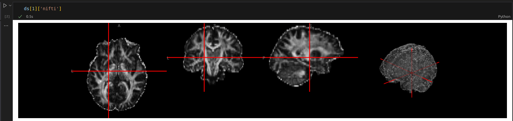

# Create an image dataset

There are two methods for creating and sharing an image dataset. This guide will show you how to:

* Create an image dataset from local files in python with [`Dataset.push_to_hub`]. This is an easy way that requires only a few steps in python.

* Create an image dataset with `ImageFolder` and some metadata. This is a no-code solution for quickly creating an image dataset with several thousand images.

> [!TIP]
> You can control access to your dataset by requiring users to share their contact information first. Check out the [Gated datasets](https://huggingface.co/docs/hub/datasets-gated) guide for more information about how to enable this feature on the Hub.

## ImageFolder

The `ImageFolder` is a dataset builder designed to quickly load an image dataset with several thousand images without requiring you to write any code.

> [!TIP]
> 💡 Take a look at the [Split pattern hierarchy](repository_structure#split-pattern-hierarchy) to learn more about how `ImageFolder` creates dataset splits based on your dataset repository structure.

`ImageFolder` automatically infers the class labels of your dataset based on the directory name. Store your dataset in a directory structure like:

```
folder/train/dog/golden_retriever.png
folder/train/dog/german_shepherd.png
folder/train/dog/chihuahua.png

folder/train/cat/maine_coon.png
folder/train/cat/bengal.png
folder/train/cat/birman.png
```

If the dataset follows the `ImageFolder` structure, then you can load it directly with [`load_dataset`]:

```py
>>> from datasets import load_dataset

>>> dataset = load_dataset("path/to/folder")
```

This is equivalent to passing `imagefolder` manually in [`load_dataset`] and the directory in `data_dir`:

```py
>>> dataset = load_dataset("imagefolder", data_dir="/path/to/folder")
```

You can also use `imagefolder` to load datasets involving multiple splits. To do so, your dataset directory should have the following structure:

```
folder/train/dog/golden_retriever.png
folder/train/cat/maine_coon.png
folder/test/dog/german_shepherd.png
folder/test/cat/bengal.png
```

> [!WARNING]
> If all image files are contained in a single directory or if they are not on the same level of directory structure, `label` column won't be added automatically. If you need it, set `drop_labels=False` explicitly.


If there is additional information you'd like to include about your dataset, like text captions or bounding boxes, add it as a `metadata.csv` file in your folder. This lets you quickly create datasets for different computer vision tasks like text captioning or object detection. You can also use a JSONL file `metadata.jsonl` or a Parquet file `metadata.parquet`.

```
folder/train/metadata.csv
folder/train/0001.png
folder/train/0002.png
folder/train/0003.png
```

You can also zip your images, and in this case each zip should contain both the images and the metadata

```
folder/train.zip
folder/test.zip
folder/validation.zip
```

Your `metadata.csv` file must have a `file_name` or `*_file_name` field which links image files with their metadata:

```csv
file_name,additional_feature
0001.png,This is a first value of a text feature you added to your images
0002.png,This is a second value of a text feature you added to your images
0003.png,This is a third value of a text feature you added to your images
```

or using `metadata.jsonl`:

```jsonl
{"file_name": "0001.png", "additional_feature": "This is a first value of a text feature you added to your images"}
{"file_name": "0002.png", "additional_feature": "This is a second value of a text feature you added to your images"}
{"file_name": "0003.png", "additional_feature": "This is a third value of a text feature you added to your images"}
```

Here the `file_name` must be the name of the image file next to the metadata file. More generally, it must be the relative path from the directory containing the metadata to the image file.

It's possible to point to more than one image in each row in your dataset, for example if both your input and output are images:

```jsonl
{"input_file_name": "0001.png", "output_file_name": "0001_output.png"}
{"input_file_name": "0002.png", "output_file_name": "0002_output.png"}
{"input_file_name": "0003.png", "output_file_name": "0003_output.png"}
```

You can also define lists of images. In that case you need to name the field `file_names` or `*_file_names`. Here is an example:

```jsonl
{"frames_file_names": ["0001_t0.png", "0001_t1.png"], label: "moving_up"}
{"frames_file_names": ["0002_t0.png", "0002_t1.png"], label: "moving_down"}
{"frames_file_names": ["0003_t0.png", "0003_t1.png"], label: "moving_right"}
```

### Image captioning

Image captioning datasets have text describing an image. An example `metadata.csv` may look like:

```csv
file_name,text
0001.png,This is a golden retriever playing with a ball
0002.png,A german shepherd
0003.png,One chihuahua
```

Load the dataset with `ImageFolder`, and it will create a `text` column for the image captions:

```py
>>> dataset = load_dataset("imagefolder", data_dir="/path/to/folder", split="train")
>>> dataset[0]["text"]
"This is a golden retriever playing with a ball"
```

### Object detection

Object detection datasets have bounding boxes and categories identifying objects in an image. An example `metadata.jsonl` may look like:

```jsonl
{"file_name": "0001.png", "objects": {"bbox": [[302.0, 109.0, 73.0, 52.0]], "categories": [0]}}
{"file_name": "0002.png", "objects": {"bbox": [[810.0, 100.0, 57.0, 28.0]], "categories": [1]}}
{"file_name": "0003.png", "objects": {"bbox": [[160.0, 31.0, 248.0, 616.0], [741.0, 68.0, 202.0, 401.0]], "categories": [2, 2]}}
```

Load the dataset with `ImageFolder`, and it will create a `objects` column with the bounding boxes and the categories:

```py
>>> dataset = load_dataset("imagefolder", data_dir="/path/to/folder", split="train")
>>> dataset[0]["objects"]
{"bbox": [[302.0, 109.0, 73.0, 52.0]], "categories": [0]}
```

### Upload dataset to the Hub

Once you've created a dataset, you can share it to the Hub with the [`~datasets.DatasetDict.push_to_hub`] method. Make sure you have the [huggingface_hub](https://huggingface.co/docs/huggingface_hub/index) library installed and you're logged in to your Hugging Face account (see the [Upload with Python tutorial](upload_dataset#upload-with-python) for more details).

Upload your dataset with [`~datasets.DatasetDict.push_to_hub`]:

```py
>>> from datasets import load_dataset

>>> dataset = load_dataset("imagefolder", data_dir="/path/to/folder", split="train")
>>> dataset.push_to_hub("stevhliu/my-image-captioning-dataset")
```

## WebDataset

The [WebDataset](https://github.com/webdataset/webdataset) format is based on TAR archives and is suitable for big image datasets.
Indeed you can group your images in TAR archives (e.g. 1GB of images per TAR archive) and have thousands of TAR archives:

```
folder/train/00000.tar
folder/train/00001.tar
folder/train/00002.tar
...
```

In the archives, each example is made of files sharing the same prefix:

```
e39871fd9fd74f55.jpg
e39871fd9fd74f55.json
f18b91585c4d3f3e.jpg
f18b91585c4d3f3e.json
ede6e66b2fb59aab.jpg
ede6e66b2fb59aab.json
ed600d57fcee4f94.jpg
ed600d57fcee4f94.json
...
```

You can put your images labels/captions/bounding boxes using JSON or text files for example.

Load your WebDataset and it will create on column per file suffix (here "jpg" and "json"):

```python
>>> from datasets import load_dataset

>>> dataset = load_dataset("webdataset", data_dir="/path/to/folder", split="train")
>>> dataset[0]["json"]
{"bbox": [[302.0, 109.0, 73.0, 52.0]], "categories": [0]}
```

It's also possible to have several images per example like this:

```
e39871fd9fd74f55.input.jpg
e39871fd9fd74f55.output.jpg
e39871fd9fd74f55.json
f18b91585c4d3f3e.input.jpg
f18b91585c4d3f3e.output.jpg
f18b91585c4d3f3e.json
...
```

For more details on the WebDataset format and the python library, please check the [WebDataset documentation](https://webdataset.github.io/webdataset).

## Visualizing images in Jupyter
If you're working in a Jupyter notebook, we added built-in support for visualizing images directly in the notebook. When you load an image dataset, the images will be displayed automatically when you return them.

```py
from datasets import load_dataset

ds = load_dataset("<path/to/folder>",
                  split="<split>")

ds[1]["nifti"]  # The image will be displayed directly in the notebook
```


